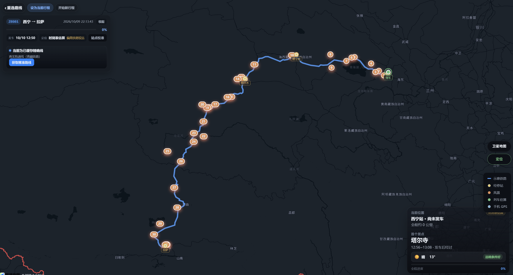
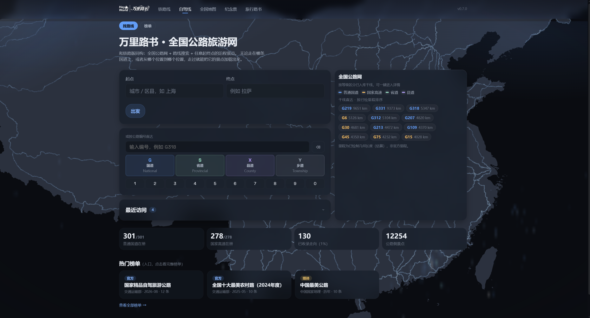
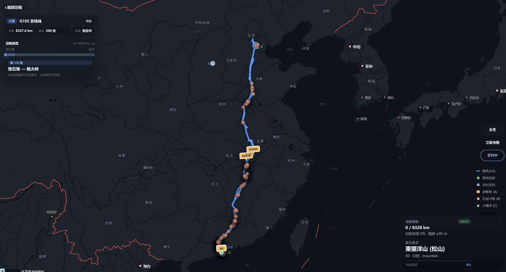
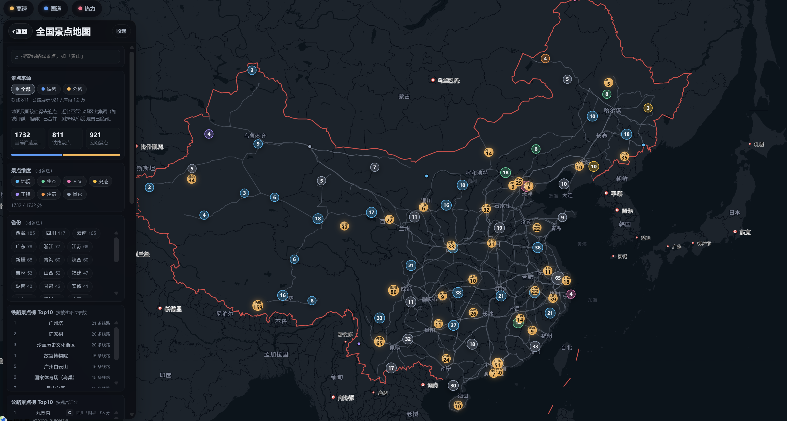

<p align="center">
  
  &nbsp;&nbsp;
  
</p>

<h1 align="center">RailVista · 万里路书</h1>

<p align="center">
  铁路车上沿途风景与行程定位伴侣，兼全国公路旅游网与旅行路书库。<br />
  选车次或公路 → 看真实走向与沿程景点 → GPS / 进度告诉你「现在在哪、下一处看什么」。
</p>

<p align="center">
  <a href="./CHANGELOG.md"></a>
  
  
  
  
</p>

<p align="center">
  
</p>

---

## 效果展示

| 铁路线 · 选行程 | 铁路线 · 行程地图 |
| :---: | :---: |
|  |  |

| 自驾线 · 全国公路网 | 自驾线 · 沿程地图 |
| :---: | :---: |
|  |  |

| 旅行路书 | 全国地图 |
| :---: | :---: |
|  |  |

---

## 能做什么

- **铁路线** — 按起终点 / 日期查车次，OD 区间地图、经停站、沿途风景；GPS + 时刻表混合定位、「即将到达」
- **自驾线** — 全国公路网检索、国道 / 省道编号直达、起终点规划；沿程章节与分级景点（讲解级 / 沿途可看 / 小确幸）
- **旅行路书** — 按省份 · 城市组织的玩法内容（自驾 / 包车 / 公共交通等），与路网底座分层
- **全国地图** — 景点总览与图层筛选
- **纪念票** — 行程相关纪念能力（随版本演进）

诚实对齐数据：公路「已贯通 km / 官方 km」、铁路几何质量门禁等，避免「看起来完整、其实飞线」。

---

## 技术栈

| 层 | 技术 |
| --- | --- |
| 前端 | Vue 3 · Vite · Pinia · 高德地图 |
| API | Hono BFF（车次 / 路网 / 几何 / 景点） |
| 共享 | `@railvista/shared`（类型、日程与进度引擎、公路 / 路书模型） |
| 数据 | 本地走廊 / 路网几何 · OSM · 景点库 |
| 部署 | Nginx · PM2 样例（见 `deploy/`） |

Monorepo：`pnpm` workspace · `apps/web` · `apps/api` · `packages/shared`。

---

## 本地开发

**前置：** Node.js ≥ 20（推荐 22）、pnpm 9。

```bash
pnpm install
pnpm --filter @railvista/shared build
pnpm dev
```

| 服务 | 地址 |
| --- | --- |
| 前端 | http://localhost:5173 |
| API 健康检查 | http://localhost:3000/api/health |

1. 复制 `apps/web/.env.example` → `apps/web/.env`，填入高德 Web Key / 安全密钥  
2. 建议配置 `apps/api/.env` 中的 `AMAP_KEY`（补全车站坐标等）  
3. 铁路几何依赖 Overpass；失败时回退站点示意折线  

演示：首页「演示：Z8991 青藏线」（不依赖 12306）。

---

## 构建与部署

```bash
pnpm -r build
# web → apps/web/dist
# api → apps/api/dist
```

参考：

- [`deploy/nginx.railvista.conf.example`](./deploy/nginx.railvista.conf.example)
- [`deploy/ecosystem.config.cjs`](./deploy/ecosystem.config.cjs)

线上建议用独立子域（例如 `rail.your-domain.cn`），与已有站点的 `www` 证书分离。

---

## 仓库结构

```
apps/web          Vue 3 SPA（铁路线 / 自驾 / 路书 / 全国地图）
apps/api          Hono BFF
packages/shared   类型 · 日程/进度 · 公路与路书模型
data/             车站 · 走廊 · 路网几何 · 景点等
deploy/           Nginx / PM2 样例
docs/             PRD · 技术方案 · 质量 playbook
docs/assets/      README 展示用截图（见上）
scripts/          路网 / 走廊 / 栅格等数据脚本
```

---

## 文档

| 文档 | 说明 |
| --- | --- |
| [CHANGELOG.md](./CHANGELOG.md) | 版本与变更（唯一入口） |
| [docs/PRD-RailVista.md](./docs/PRD-RailVista.md) | 铁路产品需求 |
| [docs/PRD-万里路书-全国公路旅游网-20261001.md](./docs/PRD-万里路书-全国公路旅游网-20261001.md) | 公路旅游网 PRD |
| [docs/rail-geometry-quality-playbook.md](./docs/rail-geometry-quality-playbook.md) | 铁路几何质量 |
| [docs/road-geometry-quality-playbook.md](./docs/road-geometry-quality-playbook.md) | 公路几何质量 |

版本号唯一来源：`packages/shared/src/version.ts` 的 `APP_VERSION`（与 CHANGELOG、界面徽标一致）。

---

## License

Private / 未开源声明前请勿擅自公开分发数据与密钥。业务与密钥请放在本地 `.env`，勿提交仓库。
