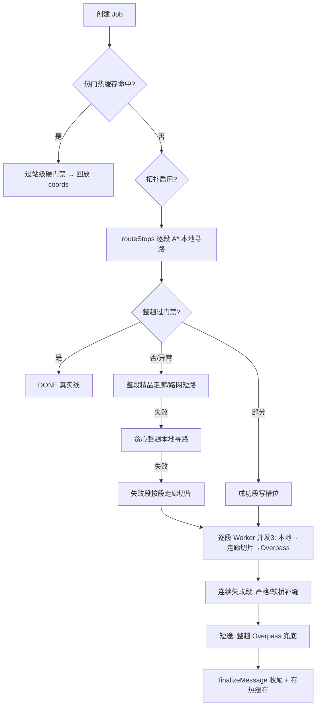
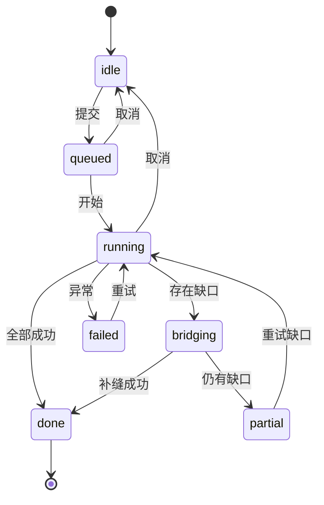

# 精准路线生成 — 性能加速、景点刷新 Bug 修复与 UI 改版报告

> 日期：2026-09-27 ｜ 范围：`apps/api`（Hono + TS）、`apps/web`（Vue3 + Vite）、`packages/shared`
> 本文只做诊断与方案设计，**未改动任何业务代码**；所有耗时均为本机实测（Node v22.23.2）或按代码常量推导。
> 结论先行：见 0.1 / 0.2 / 0.3。

---

## 0. 结论摘要

### 0.1 一句话结论

**「生成精准路线慢」的主因不是本地算法，而是未命中本地数据时逐段依赖公共 Overpass 服务——该服务当前频繁超时（dev.log 多次 `overpass batch failed/timeout`），且「整趟兜底」路径把 3 个镜像串行试探、单次最长约 75s；其次是前端每 1.5s 轮询时，后端都把 432 个景点对整条折线重算一遍（实测 90–183ms 阻塞事件循环）。「景点不刷新」是一个独立的前端渲染 Bug：地图景点标记在 `initMap()` 中只创建一次，且缺少对 `trip.scenicSpots` 的监听器，所以折线更新了、景点标记仍停留在示意线阶段。**

### 0.2 实测基线（2026-09-27 本机）

| 环节 | 实测 / 现状 | 代码位置 |
|---|---|---|
| 拓扑图加载（一次性） | 2,051,051 节点 / 2,253,455 边，**460–667ms** | `railTopology.ts:81` |
| 拓扑逐段寻路（热，21 段整趟） | **20–26ms**（约 1ms/段） | `railTopology.ts:411` |
| 拓扑单条超长 OD（A*） | **148ms** | `railTopology.ts:316` |
| 段级 Overpass 超时 | 单镜像 **25s**（段级已限定 1 镜像） | `osmRailway.ts:529` |
| 整趟 Overpass 镜像策略 | **3 镜像串行**，单查询最坏 3×25 ≈ **75s** | `osmRailway.ts:54`（默认 `maxMirrors=3`） |
| 整趟拉取方式 | bbox + 各 chunk **串行**，chunk 间固定 +200ms | `osmRailway.ts:184-192` |
| 每次轮询重算景点（576 点） | **14ms** | `railGeometryJob.ts:311` |
| 每次轮询重算景点（3,859 点） | **89ms** | 同上 |
| 每次轮询重算景点（6,062 点） | **118ms** | 同上 |
| 每次轮询重算景点（10,327 点） | **183ms** | 同上 |
| 景点库规模 | **432** 个 | `data/presets/scenic-spots.json` |
| 段缓存持久化 | **仅内存**，进程重启即失效 | `cache.ts` |
| Overpass 当前健康度 | dev.log 多次 `geocode overpass batch failed/timeout` | `dev.log:35-39,63-67,73-77` |
| 地图景点标记 | `initMap()` **只创建一次，无 `scenicSpots` 监听器** | `TripMap.vue:520-573` |

**推导的长尾耗时（未命中本地数据、Overpass 偏慢时）：**

```
逐段 OSM：ceil(待算段数 / 并发3) × 单段(最坏25s)
          ＋ 连续失败段补缝（再发 Overpass）
          ＋ 短途整趟兜底（bbox+chunks 串行，每查询最坏75s）
          ───────────────────────────────────────────
          20+ 段长途：约 60–120s（与服务端墙钟 max(120s, 10s×段数) 对齐）
          命中本地/热缓存：< 1s
```

### 0.3 优先级清单（建议按序落地）

| 级别 | 项 | 一句话 | 预期收益 |
|---|---|---|---|
| **P0** | **F1** | 整趟 Overpass 改「并发竞速 + 总预算」，收敛镜像与超时 | 单查询长尾 **75s → 8–12s** |
| **P0** | **F2** | 段级结果落盘缓存 + 负缓存调优 + 热门 OD 预热 | 二次生成 **分钟级 → <200ms**，减少 Overpass 依赖 |
| **P0** | **B1** | 修复景点不刷新：新增 `rebuildSpotMarkers()` + 监听 `scenicSpots` | 精准路线生成后景点**必同步** |
| **P1** | **F3** | 景点匹配按 job 记忆化，仅在 coords 变化时重算 | 消除每次轮询 **90–183ms** 阻塞 |
| **P1** | **B2** | 修复数据层「旧景点只减不增」，最终态始终用全量重算结果 | 杜绝漏景点 |
| **P1** | **F4** | Overpass 请求 in-flight 去重 + 相邻段几何复用 | 减少重复公网往返 |
| **P2** | **F5** | 轮询改 SSE/WebSocket（或自适应轮询） | 完成即达，去掉冗余轮询与 CPU |
| **P2** | **F6** | CPU 密集计算移入 worker / 进程集群 | 利用多核，主线程不卡顿 |
| **P2** | **U1** | 生成精准路线 UI 改版为「精度状态面板」 | 专业、可信、状态清晰 |

---

## 1. 精准路线生成链路现状

### 1.1 前端触发与轮询

- 入口：地图页状态卡内按钮「获取精准路线」→ `TripMap.vue` 的 `onUpgradePrecise()` → `tripStore.upgradePrecise()`。
- `upgradePrecise()` 调 `POST /api/rail-geometry/jobs` 创建任务，随后用 `setInterval` **每 1.5s** 调 `GET /api/rail-geometry/jobs/:jobId` 轮询；前端另设 180s（长途 300s）硬超时。
- 选车页进入时已用 `mode:'preset'` 取过一次：命中精品走廊即真实线，否则返回**站点示意折线** `source:'station'`，并附带按该示意线匹配的景点（即用户口中的「非精准路线时的景点」）。

### 1.2 后端任务编排（`railGeometryJob.ts` 的 `runJob`）



**关键点：** 后端 `snapshot()`（每次创建/轮询都会调用）末尾固定执行
`scenicSpots: matchScenicSpotsForRailway(job.coords)`，即**服务端始终按当前折线返回最新景点**。这说明景点数据在服务端是正确的，问题出在前端（见第 3 节）。

---

## 2. 性能诊断与加速

### 2.1 [P0] Overpass 公共服务：主要墙钟与长尾来源

#### 诊断

| # | 瓶颈 | 证据 / 现状 | 影响 |
|---|---|---|---|
| F-1 | **整趟路径 3 镜像串行** | `overpass()` 默认 `maxMirrors = OVERPASS_URLS.length(3)`，`for...of await`，首个镜像挂到 25s 才换下一个 | 一次逻辑查询最坏 **≈75s** |
| F-2 | **bbox 与 chunk 串行** | `fetchWaysAlongRoute` 先 await bbox，再逐 chunk await，chunk 间固定 `setTimeout 200ms` | 长线耗时逐项累加 |
| F-3 | **Overpass 当前不健康** | dev.log 连续多条 `geocode overpass batch failed/timeout`、`stops ... timedOut:true` | 当下等待被显著放大 |
| F-4 | **段缓存仅内存** | 命中走 `cache.ts`（内存 Map），进程/`tsx watch` 重启即失效 | 重启后首查必冷，重打 Overpass |
| F-5 | **相邻段重复查询** | 段 worker 各自 `fetchWaysForSegment`，相邻 OD 的 9–18km 缓冲高度重叠，无去重 | 冗余公网请求，更易触发限流 |
| F-6 | **无并发竞速** | 镜像间是「失败才换」，不是「谁快用谁」 | 被迫等待慢镜像 |

> 注：段级路径已通过 `maxMirrors:1` 限定单镜像（`osmRailway.ts:531`），问题主要集中在**整趟兜底** `buildRailGeometry → fetchWaysAlongRoute` 与 geocode 补坐标。

#### 优化方案

**F1 [P0] 并发竞速 + 总预算（替代串行镜像）**
- 做法：整趟查询对镜像采用「并发发出、`Promise.any` 取首个成功，`Promise.allSettled` 兜底」；设置**总预算**（建议 8–12s），单请求超时降到 8–10s；超时统一抛 `OVERPASS_BUDGET`。
- 预期收益：单查询长尾 **75s → 8–12s（约 -85%）**。
- 改动范围：`osmRailway.ts` 的 `overpass()` 与 `fetchWaysAlongRoute`（约 30–40 行）；通用 HTTP 逻辑可复用 `services/http.ts`。
- 风险：并发会瞬时增加镜像请求数——整趟查询调用频次低，可控；需保留「全部失败才判失败」。

**F2 [P0] 段结果落盘 + 负缓存调优 + 预热**
- 做法：① 成功段折线持久化到磁盘（复用 `data/cache` 目录与版本指纹，算法变更随 `segmentCacheKey` 版本号失效）；② 负缓存（`missKey`，现 20min）按「无数据 / 超时」区分，超时类缩短到 30–60s 以便自愈；③ 对热门 OD（可由 `data/presets/precise-hotlist.json`）在启动/空闲时预热。
- 预期收益：相同/相近 OD 二次生成 **分钟级 → <200ms**；Overpass 调用次数随覆盖率下降。
- 改动范围：新增持久化适配（可扩展 `preciseRouteCache.ts` 思路），`osmRailway.ts` 读写段缓存处。
- 风险：落盘需带几何版本与 TTL，避免脏几何（项目已有 `GEOM_VERSION`/`v10` 版本号纪律，沿用即可）。

**F4 [P1] in-flight 去重 + 几何复用**
- 做法：模块级维护「进行中 Overpass 请求的 Promise 单例」，相同 query 共享结果；相邻段已取回的 way 按 id 复用，避免重复拉取。
- 预期收益：减少冗余往返，降低被限流概率。
- 改动范围：`osmRailway.ts`（约 20 行）。

### 2.2 [P1] 每次轮询重算景点：重复且阻塞事件循环

#### 诊断（实测）

| 折线点数 | 单次 `matchScenicSpotsForRailway` 中位耗时 |
|---|---|
| 576 | **14ms** |
| 3,859 | **89ms** |
| 6,062 | **118ms** |
| 10,327 | **183ms** |

- 根因：`filterSpotsAlongRailway` 对 **432 个景点 × 折线每一段** 各做一次含三角函数的 `haversineKm`（`projectToRailway`，`progress.ts:164`）。
- `snapshot()` 在**创建响应 + 每次 1.5s 轮询**都重算，且 coords 未变也照算；单线程 Node 期间无法处理 Overpass 回调与其他请求。

#### 优化方案

**F3 [P1] 按 Job 记忆化，coords 变化才重算**
- 做法：在 Job 上缓存 `{ coordsSignature, scenicSpots }`；`snapshot()` 先比对签名（建议 `coords.length + 首尾点 + segmentsOk` 或轻量哈希），未变直接复用；运行中可降低景点更新频率（如每 N 秒或段数变化时），**最终态（done/partial）保证重算一次**。
- 预期收益：消除每次轮询 **90–183ms** 阻塞，事件循环更顺、Overpass 响应处理更及时。
- 改动范围：`railGeometryJob.ts` 的 `snapshot/refreshJobDerived`（约 15–20 行）。
- 风险：签名需能捕捉折线真实变化，宁可贵一点重算，也不能返回旧景点。

### 2.3 [P2] 其它

- **F5 轮询 → SSE/WebSocket（或自适应轮询）**：任务完成由服务端推送，前端即时收尾；同时天然消除第 2.2 的重复轮询 CPU。短期可先把固定 1.5s 改为「退避自适应 + 完成即停」。
- **F6 worker / 集群**：实测拓扑热启动很便宜（整趟 20–60ms、单超长段 148ms、一次性加载 0.5–0.7s），**当前不是瓶颈**；若后续要在多核上隔离 CPU，可把拓扑/景点匹配移入 `worker_threads`，或在调整 `singleInstance` 前提下按核集群。
- `buildAdj` 为 O(W²)（`osmRailway.ts:200`）：整趟大 bbox（span<650km）way 数量大时建议加空间分桶或限定候选。
- `acceptSegmentGeometry` 中 `Math.min(...line.map(...))`（`osmRailway.ts:456-457`）对超长数组有展开开销/栈风险，改为循环求最小值。
- `dijkstraPath` 用数组 `sort()` 取最小（`osmRailway.ts:282`），可复用拓扑里的 `MinHeap`。

### 2.4 目标性能指标

| 场景 | 现在 | 目标（落地 F1–F4 后） |
|---|---|---|
| 命中本地/热缓存 | <1s | **<0.2s** |
| 相同 OD 二次生成 | 分钟级（重启后必冷） | **<0.2s（落盘缓存）** |
| 未命中本地、Overpass 慢 | 60–120s 长尾 | 单查询 **≤8–12s**，整趟多数 **≤20–30s** |
| 轮询期间主线程阻塞 | 每 1.5s 阻塞 90–183ms | **≈0（记忆化）** |
| 完成反馈延迟 | 最坏 1.5s | **即时（SSE）/ ≤1.5s** |

---

## 3. Bug：精准路线生成后景点不刷新

### 3.1 复现与现象

1. 选车进入地图（无精品走廊时为站点示意线），地图显示按示意线匹配的景点标记。
2. 点击「获取精准路线」，等待生成完成：**蓝色折线变为真实轨道**，但**地图上的景点标记仍是示意线那一组**（数量、位置、编号都不变）。

### 3.2 根因（渲染层，P0 —— 即用户报告的 Bug）

- `TripMap.vue` 的 `initMap()` 在 **520–573 行**用 `trip.scenicSpops` 一次性构建 `spotMarkers`，之后再无更新。
- 同文件对其它图层都有同步机制，唯独景点没有：

| 数据 | 同步机制（TripMap.vue） |
|---|---|
| 铁路折线 `railwayCoords` | `watch(..., {deep})` → `refreshRailLine()`（826–832） |
| 经停站坐标 | `watch(...)` → `refreshStationMarkers()`（834–839） |
| 未解析站 `unresolvedStops` | `watch(...)` → `rebuildUnresolvedMarkers()`（841–846） |
| **景点 `scenicSpots`** | **无 watch、无重建函数** |

- 因此出现「折线刷新、景点不刷新」的割裂现象。
- 佐证：底部面板「即将到达」的 `upcoming` 计算属性直接读 `trip.scenicSpots`（`TripMap.vue:336`），其数据其实是新的——说明 **store 数据正确，纯为地图标记未同步**。

### 3.3 数据层次级隐患（P1）

- `tripStore.applyPreciseCoords()` 中（271–293 行）：若传入 `opts.scenicSpots` 则用之；**否则用「旧的 `scenicSpots.value`」对新折线再过滤**。
- 该分支只会把旧景点**剔除**，永远无法**新增**新折线进入视野的景点（只减不增）。它在以下情况被触发：
  - `finishJob()` 中 `shouldApplyJobCoords(job)` 为 false 时传 `scenicSpots: undefined`（757 行）；
  - 失败/超时分支调用 `applyPreciseCoords` 时未传景点（604、739 行）。

### 3.4 修复方案（报告级，给方向与要点）

**B1 [P0] 让景点标记随 `scenicSpots` 重建**
- 新增 `rebuildSpotMarkers()`：`map.remove` 旧标记 → 用最新 `trip.scenicSpots` 重建（复用 520–573 的标记/弹窗工厂）→ 按 `prefs.layers.spot` 重新施加显隐 → 编号按新顺序生成。
- 新增监听器：`watch(() => 景点签名, rebuildSpotMarkers)`，签名建议取 `scenicSpots.map(s => s.id).join('|')`（数量/成员变化即重建）。
- 要点与取舍：
  - 简单稳健做法是**整体重建**（与 `rebuildUnresolvedMarkers` 同风格）；若希望保留已打开的 InfoWindow、减少闪烁，可按 `id` 做增量 diff（新增/移除/移动），但首版建议先整体重建。
  - 重建后需重新 `applyLayers()`，并在 `onUpgradePrecise()` 收尾处确保调用一次。
  - 组件卸载（`onUnmounted`）时随地图 `destroy` 一并清理，避免泄漏。

**B2 [P1] 最终态景点始终来自全量重算**
- 原则：**权威景点集合 = 后端用全量库对最终折线的匹配结果**（后端已如此计算）。
- `finishJob()` 应用最终坐标时始终传入与 `displayCoords` 对应的 `job.scenicSpots`（`keptBest` 时 `displayCoords` 是 best 折线，应同时保存/复用该折线对应的景点，建议在 `bestPrecise` 中一并记录 `scenicSpots`）。
- 移除/弱化「用旧景点子集再过滤来获得新景点」的路径；离线拿不到后端结果时，明确保留旧集合并标注「景点可能未更新」，而不是暗示其完整。

### 3.5 验收与回归

- 示意线 → 精准线完成后，地图景点标记与 `trip.scenicSpots` **完全一致**（数量、位置、编号、沿线顺序）。
- 切换不同 OD（含会作废旧 Job 的场景）后，景点随新折线重建，无残留旧标记。
- 关闭「风景」图层时新标记也遵守显隐；打开 InfoWindow、定位、卫星图切换不报错。
- 单测/组件测试：模拟 `scenicSpots` 变化，断言标记被重建；数据层断言新折线能「新增」景点而非只减。

---

## 4. UI 重设计：生成精准路线

### 4.1 现状问题

- 形态：仅是状态卡内 `.status-actions` 中一个**全宽小按钮**，所有反馈（排队/进度/补缝/结果/错误）都压缩在按钮文案里，长文案被截断。
- 缺：分段进度条、百分比、预计耗时、当前阶段、来源/精度标识、取消入口。
- 成功后按钮文案回到「获取精准路线」，但此时 `canUpgradePrecise=false`、点击无效——**呈现为一个无效按钮**，易让用户误以为没生成或可重复生成。
- 错误与「坐标待补」提示是零散的 `<p>`，信息层级不统一。
- 项目已有精致的 `RailProgressLoader.vue`（复兴号沿轨道推进），但仅用于选车页，未在此复用。

### 4.2 设计目标与原则

- **可信**：明确告知「当前是示意线还是真实线、数据来源、精度范围」。
- **可感知**：阶段、进度、预计耗时、可取消；慢/超时有人性化反馈而非卡死。
- **专业克制**：复用现有深色 + 天蓝（`#38bdf8/#0ea5e9`）体系与面板语言，不堆砌颜色、不挡地图。
- **收敛**：完成后折叠为一枚「精度摘要」，需要时再展开。
- 适配移动端（≤640px）、键盘可达、`prefers-reduced-motion`、ARIA 完整。

### 4.3 状态机

| 状态 | 主色 | 标题 | 主要内容 | 主动作 |
|---|---|---|---|---|
| `idle` 可升级 | 天蓝 | 精准路线 | 当前为站点示意线 | 获取精准路线 |
| `queued` 排队 | 天蓝 | 排队中 | 第 N 位… | 取消 |
| `running` 生成中 | 天蓝 | 正在生成精准路线 | 分段进度条 + % + 阶段 + ETA | 取消 |
| `bridging` 补缝 | 琥珀 | 正在补全缺口 | x/y，缺口处理中 | 取消 |
| `done` 已完成 | 青绿 | 精准路线已生成 | 来源/精度徽标 + 里程 + 景点数 | 展开/重新生成（弱） |
| `partial` 部分精确 | 琥珀 | 已精确 x/y | 缺口为示意 | 重试缺口 / 全部重算 |
| `failed` 失败 | 红 | 生成未成功 | 原因 | 重试 |
| `offline` 仅示意 | 灰 | 暂不可用 | 本地未覆盖且网络不可用 | 稍后重试 |



### 4.4 线框（ASCII，桌面/移动通用，宽度随面板）

**① idle（可升级）**
```
┌─────────────────────────────────────────────┐
│ ◳ 精准路线                         [获取 ▸] │
│   当前为站点示意线，非真实轨道               │
└─────────────────────────────────────────────┘
```

**② running（生成中）**
```
┌─────────────────────────────────────────────┐
│ ◌ 正在生成精准路线            12/15   [ ✕ ] │
│ ▰▰▰▰▰▰▰▰▱▱▱▱▱  80%   预计还需 ~3s            │
│ 正在匹配 英德 → 广州北（本地路网）          │
└─────────────────────────────────────────────┘
```

**③ done（完成 → 折叠为摘要）**
```
展开态：
┌─────────────────────────────────────────────┐
│ ● 精准路线已生成                            │
│ [精品路网]  全程 1,032 km · 沿线 11 个景点  │
│ 数据来源：本地轨网            [重新生成 ⟳]  │
└─────────────────────────────────────────────┘
折叠态（常驻一行）：
┌─────────────────────────────────────────────┐
│ ● 精准路线 · 本地轨网            [展开 ⌄]   │
└─────────────────────────────────────────────┘
```

**④ partial / failed**
```
┌─────────────────────────────────────────────┐
│ ▲ 已精确 9/12，缺口为示意                   │
│                          [重试缺口] [重算]  │
└─────────────────────────────────────────────┘
┌─────────────────────────────────────────────┐
│ ✕ 生成未成功：网络超时             [重试 ⟳] │
└─────────────────────────────────────────────┘
```

### 4.5 视觉规范（建议 token）

| 项 | 规范 |
|---|---|
| 容器 | 与 `.status-card` 同语言：圆角 12–14、1px 描边（`rgba(148,163,184,.22)`）、毛玻璃、内边距 10–12、间距 8 |
| 主色（进行中） | `#38bdf8/#0ea5e9`，进度条渐变 `linear-gradient(90deg,#0ea5e9,#38bdf8)` |
| 成功 | 青绿 `#2dd4bf/#34d399`；警示 `#fbbf24`；失败 `#f87171/#fca5a5`；离线 `#94a3b8` |
| 进度条 | 高 4–6px、圆角 999；不确定态加细微 shimmer；过渡 `width .35s ease` |
| 文字 | 标题 13–14px/700；说明 11–12px/常规、`#94a3b8`；数字用 `font-variant-numeric: tabular-nums` |
| 图标 | 16–18px，线性、与文字同色；状态点 8px |
| 按钮 | 主操作实色/描边小按钮（高 30–32、圆角 8）；次要操作为文字/幽灵按钮，避免多个大按钮 |
| 动效 | 状态切换 150–250ms；尊重 `prefers-reduced-motion`；进度更新不触发布局抖动 |

### 4.6 组件拆分与落点

- 新增 **`PreciseRoutePanel.vue`**（状态驱动：读 `trip.preciseJob / preciseLoading / railwaySource / canUpgradePrecise`），替换现 `.status-actions` 内的单按钮；按 4.3 状态渲染 4.4 的各态。
- 进度可视化可复用/抽象 `RailProgressLoader` 的轨道与列车元素，保持全站「列车沿轨道推进」的统一隐喻；地图页以**紧凑型横向进度**为宜，避免全屏遮罩挡住地图。
- 样式在 `map.css` 内以 `.precise-*` 前缀集中管理；颜色/间距优先用现有 CSS 变量，不新造体系。
- 完成后默认折叠为单行「精度摘要」，减少对地图的遮挡。

### 4.7 交互与无障碍

- 提供显式**取消**：前端中止轮询并通知服务端废弃 Job（沿用 `abandonJob`/`preciseEpoch` 机制）。
- 进度区使用 `role="progressbar"` + `aria-valuenow/min/max`；状态文案用 `aria-live="polite"` 播报。
- 所有操作可 Tab 聚焦、Enter/Space 触发；图标按钮带 `aria-label`。
- 慢于阈值（如 8s）切换为「可取消的慢速态 + 已等待 N 秒」，与选车页加载器体验一致。

---

## 5. 实施计划（建议）

| 阶段 | 内容 | 关联项 | 预估（人时） |
|---|---|---|---|
| 阶段一（止血） | 景点标记重建 + 数据层全量重算；整趟 Overpass 并发竞速与总预算 | B1、B2、F1 | 4–6 |
| 阶段二（提速） | 段结果落盘 + 负缓存调优 + 热门预热 + 请求去重 | F2、F4 | 4–8 |
| 阶段三（体验） | 精准路线精度面板 UI 改版（含完成折叠、取消、状态徽标） | U1 | 4–6 |
| 阶段四（打磨） | 景点记忆化、SSE/自适应轮询、worker/集群（按需） | F3、F5、F6 | 3–6 |

> 建议阶段一作为一次小版本优先发布（同时解决用户最直观的 Bug 与最长尾）。

---

## 6. 验收标准与性能验证

**功能验收**
- 精准路线完成后，地图景点、底部「即将到达」、精度面板三者数据一致，且随 OD 切换正确重建。
- 各 UI 状态（idle/queued/running/bridging/done/partial/failed/offline）均有明确呈现与终态，无死按钮、无无限等待。

**性能验证（建议沉淀为脚本/基线）**
- 扩展 `apps/api/scripts/perf-smoke.ts`，新增精准路线用例：冷启动、热缓存、相同 OD 二次生成、段成功率、整趟 Overpass 预算命中情况。
- 对 `snapshot()` 景点匹配与拓扑寻路加 `console.time`/埋点，记录事件循环阻塞与 P50/P95；本文实测脚本（景点 14–183ms、拓扑 20–148ms）可作为对照基线。
- 回归：跑通 `corridors / osmRailway / preciseRouteCache / railGeometryJob / scenicSpots` 既有测试，并新增「景点随 `scenicSpots` 重建」「新折线可新增景点」用例。

**目标红线**
- 命中缓存 <0.2s；未命中且上游慢时单查询 ≤8–12s、整趟多数 ≤20–30s；轮询期间主线程近零阻塞；完成反馈即时。

---

## 7. 附录：关键代码位置

| 关注点 | 位置 |
|---|---|
| 精准路线由（编排/状态机） | `apps/api/src/services/railGeometryJob.ts`（`runJob` 355、`snapshot` 297、`finishJob` 691） |
| 精准路线由（HTTP 路由） | `apps/api/src/routes/railGeometry.ts`（`/jobs` 70、轮询 156、同步 168） |
| OSM/Overpass 拼线 | `apps/api/src/services/osmRailway.ts`（`overpass` 54、`fetchWaysAlongRoute` 153、`buildSegmentGeometry` 588、`buildRailGeometry` 708） |
| 拓扑寻路 | `apps/api/src/services/railTopology.ts`（加载 81、A* 316、逐段 411） |
| 景点匹配（后端） | `apps/api/src/services/scenicSpots.ts`（51） |
| 景点过滤（共享） | `packages/shared/src/schedule/scenic.ts`（51）、投影 `packages/shared/src/schedule/progress.ts`（164） |
| 热缓存（落盘） | `apps/api/src/services/preciseRouteCache.ts` |
| 前端状态/数据层 Bug | `apps/web/src/stores/tripStore.ts`（`applyPreciseCoords` 271、`finishJob` 696） |
| 前端渲染 Bug / UI 落点 | `apps/web/src/pages/TripMap.vue`（景点标记 520、watch 826–846、按钮 942–955） |
| 现有可复用加载组件 | `apps/web/src/components/RailProgressLoader.vue` |
| 样式 | `apps/web/src/styles/map.css`（状态卡 158、按钮 379）、`base.css`（按钮 62） |

> 备注：本文性能数字为开发机单次/少量样本实测，落地时建议以 P50/P95 多次采样为准；上游 Overpass 健康度随时间波动，超时与竞速策略比单点耗时更关键。
