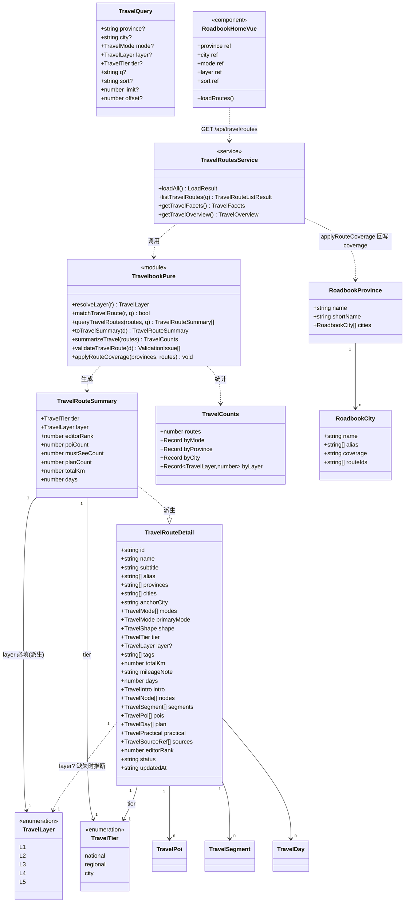
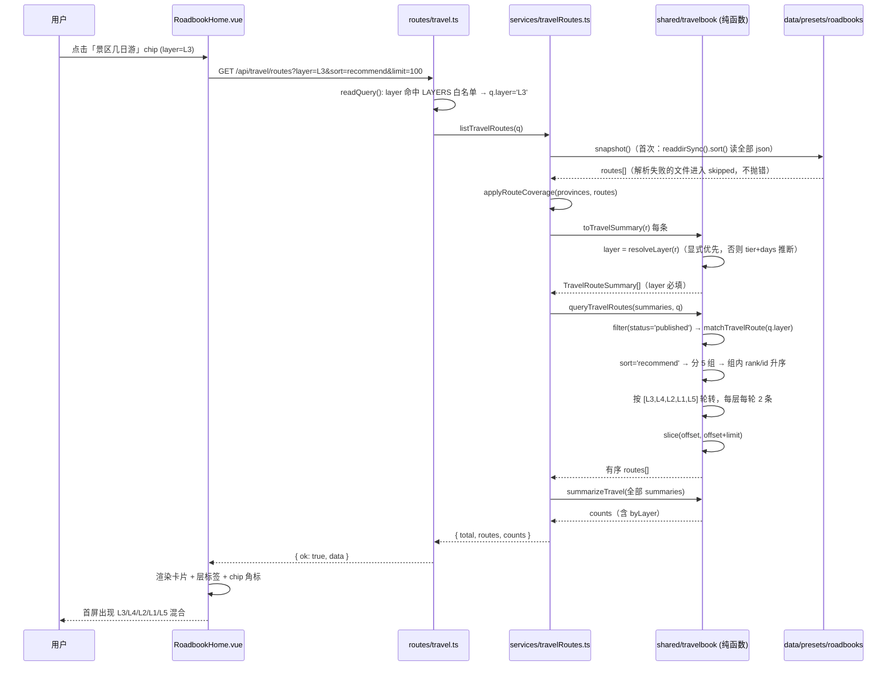
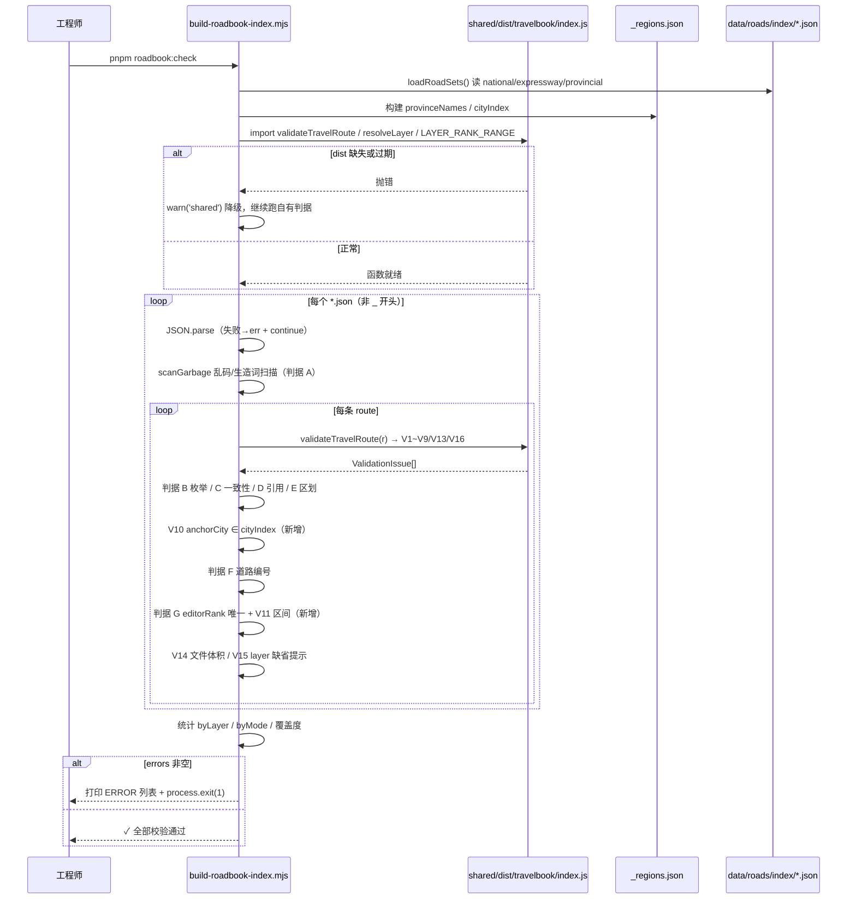
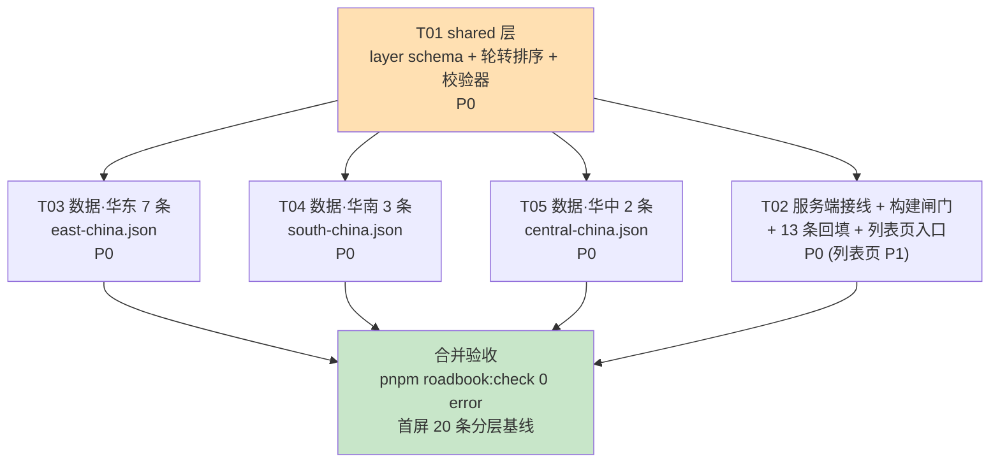

# 万里路书 · 路书库内容分层与阶段 1A —— 增量系统设计 + 任务分解

> 文档日期：2026-10-07　分支：`feat/road-national-through-20261005`
> 作者：高见远（架构师）　读者：工程师（寇豆码）+ 后续接力的 AI
> 上游输入：`docs/PRD-路书库内容体系与全国覆盖-20261007.md`（许清楚）
> 主理人已拍板约束：**D1（layer 字段）/ D2（editorRank 分层区间）/ D3（分层轮转排序）/ D4（本轮只做批次 1A = 12 条）/ D5（内容红线）**
> 本文**不修改任何代码或数据文件**，只给改动点、判据与任务。

---

## 0. 现状核对（我实际读代码得到的结论，实现前请先确认未被改动）

| 事实 | 值 | 来源 |
|---|---|---|
| 现有路线数 | **13 条**，全部 `tier: national` | `data/presets/roadbooks/*.json`（9 个文件） |
| `editorRank` | 1~13，无重复，无 `layer` 字段 | 同上 |
| 区划底座 | 34 省 / 393 地级，`_regions.json` | `scripts/build-roadbook-index.mjs` 输出 |
| 默认排序 | `a.editorRank - b.editorRank \|\| b.totalKm - a.totalKm` | `packages/shared/src/travelbook/types.ts` **L530-534** |
| 列表页 | 省份 chip / 城市 chip / 玩法 chip / 关键词 / 排序 select（`limit: 100`） | `apps/web/src/pages/RoadbookHome.vue` **L82-89、L232-234** |
| 装载器行为 | 单个文件 JSON 解析失败 → `skipped.push()`，**不崩** | `apps/api/src/services/travelRoutes.ts` **L102-104** |
| ⚠️ 关键发现 | `validateTravelRoute()` **目前没有任何调用方**（全仓仅定义处 1 处命中） | 全仓 grep `validateTravelRoute` |

> **架构判断（重要）**：`validateTravelRoute()` 是一份"写了但没接线"的契约。本次补强如果只改它，**运行时不会有任何效果**。
> 因此本设计把它接到唯一构建闸门 `scripts/build-roadbook-index.mjs` 上（该脚本是 `.mjs`，可以直接 `import` 已编译的 `packages/shared/dist/travelbook/index.js`，不需要新起一个脚本工程），并新增 npm script `roadbook:check`。见 §3.1。

---

# Part A · 系统设计

## 1. 增量 Schema 设计：`layer` 字段

### 1.1 类型定义

在 `packages/shared/src/travelbook/types.ts` 的 `TravelTier` 定义之后（`TRAVEL_TIER_LABEL` 结束于 **L78**）新增：

```ts
/** 内容分层（PRD §3.1）。tier 只有三值，无法区分「景区几日游 / 周末线 / 小众城市」，故新增 layer。 */
export type TravelLayer = 'L1' | 'L2' | 'L3' | 'L4' | 'L5';

export const TRAVEL_LAYER_LABEL: Record<TravelLayer, string> = {
  L1: '国家级大环线',
  L2: '省域环线',
  L3: '景区几日游',
  L4: '周末周边',
  L5: '小众目的地',
};

/** editorRank 分层区间（左闭右开）。判据 G 保证全库唯一，本表保证「落在所属层区间」。 */
export const LAYER_RANK_RANGE: Record<TravelLayer, [number, number]> = {
  L1: [1, 100], L2: [100, 200], L3: [200, 300], L4: [300, 400], L5: [400, 500],
};

/** 分层轮转的层序（PRD §3.5）：先给「说走就走」的短内容，再给大线。 */
export const RECOMMEND_LAYER_ROTATION: TravelLayer[] = ['L3', 'L4', 'L2', 'L1', 'L5'];

/** 轮转时每层每轮取几条 */
export const RECOMMEND_ROTATION_STEP = 2;
```

### 1.2 字段可选性与缺失推断规则

| 接口 | 字段 | 形态 | 理由 |
|---|---|---|---|
| `TravelRouteDetail` | `layer?: TravelLayer` | **可选** | 现有 13 条与后续批次可能漏填，可选保证"不填也能跑"，不破坏存量 |
| `TravelRouteSummary` | `layer: TravelLayer` | **必填** | 列表页/统计/排序都依赖它；由 `toTravelSummary()` 解析得出，调用方永远拿得到确定值 |

推断函数（新增纯函数，放在 `types.ts` 的"纯函数区"之前，约 **L450** 处，与 `includesText` 同层）：

```ts
/**
 * 解析路线的内容分层。
 * 显式 layer 优先；缺省时按 tier + days 推断。**推断永不产出 L5**（冷门是主观判断，只能人工标注）。
 */
export function resolveLayer(r: {
  layer?: TravelLayer; tier?: TravelTier; days?: number;
}): TravelLayer {
  if (r.layer) return r.layer;
  if (r.tier === 'national') return 'L1';
  if (r.tier === 'regional') return 'L2';
  // tier === 'city' 或缺失
  const d = typeof r.days === 'number' && r.days > 0 ? r.days : 2;
  return d <= 2 ? 'L4' : 'L3';
}
```

推断对照表（与 D1 完全一致）：

| `tier` | `days` | 推断 `layer` |
|---|---|---|
| `national` | 任意 | **L1** |
| `regional` | 任意 | **L2** |
| `city` | ≤ 2 | **L4** |
| `city` | ≥ 3 | **L3** |
| 缺失 / 非法 | 缺失 | **L4**（保守取短途，避免把未知数据塞进 L3 抢首屏） |
| — | — | **L5 只能显式标注** |

### 1.3 `TravelQuery.layer` 与 `TravelCounts.byLayer`

- `TravelQuery`（**L455-479**）新增：`layer?: TravelLayer;`
- `TravelQuery.sort`（**L476**）枚举扩展：`'recommend' | 'km-desc' | 'km-asc' | 'days-asc' | 'days-desc' | 'layer'`
  - `'layer'` = 跳过轮转，纯 `editorRank` 升序（给"我就想看全部大线"用）
- `TravelCounts`（**L429-442**）新增：`byLayer: Record<TravelLayer, number>;`（5 个键恒存在，缺层填 0，方便列表页 chip 角标直接读）

### 1.4 现有 13 条如何回填

**全部 `layer: 'L1'`，`editorRank` 一个都不动。** 因为它们全为 `tier: 'national'`，即使不回填，推断结果也是 L1 —— 回填只是把隐式规则显式化，属于零风险治理。

| 文件 | 路线 id | 现 rank | 回填 |
|---|---|---|---|
| `qinghai-gansu-loop.json` | `qinghai-gansu-loop` | 1 | `layer: 'L1'` |
| `sichuan-west-loop.json` | `sichuan-tibet-south` | 2 | `layer: 'L1'` |
| `inner-mongolia-hulunbuir.json` | `hulunbuir-daxinganling-loop` | 3 | `layer: 'L1'` |
| `xinjiang-yili-loop.json` | `yili-grand-loop` | 4 | `layer: 'L1'` |
| `xinjiang-altay-loop.json` | `altay-loop` | 5 | `layer: 'L1'` |
| `tibet-rings.json` | `xizang-grand-loop` | 6 | `layer: 'L1'` |
| `yunnan-sichuan-shangrila-daocheng.json` | `shangri-la-daocheng` | 7 | `layer: 'L1'` |
| `sichuan-west-loop.json` | `sichuan-west-loop` | 8 | `layer: 'L1'` |
| `xinjiang-south-loop.json` | `southern-xinjiang-loop` | 9 | `layer: 'L1'` |
| `tibet-rings.json` | `ali-grand-loop` | 10 | `layer: 'L1'` |
| `yunnan-sichuan-shangrila-daocheng.json` | `yunnan-tibet-line` | 11 | `layer: 'L1'` |
| `tibet-access-north.json` | `qinghai-tibet-line` | 12 | `layer: 'L1'` |
| `tibet-access-south.json` | `xinjiang-tibet-line` | 13 | `layer: 'L1'` |

### 1.5 改动点清单（精确到文件 + 函数/行号）

| # | 文件 | 位置 | 改什么 |
|---|---|---|---|
| C1 | `packages/shared/src/travelbook/types.ts` | **L78 之后**插入 | 新类型 `TravelLayer`、`TRAVEL_LAYER_LABEL`、`LAYER_RANK_RANGE`、`RECOMMEND_LAYER_ROTATION`、`RECOMMEND_ROTATION_STEP` |
| C2 | 同上 | **L365 `tier` 之后** | `TravelRouteDetail` 加 `layer?: TravelLayer`（附注释：可选，缺省按 tier+days 推断） |
| C3 | 同上 | **L408 `tier` 之后** | `TravelRouteSummary` 加 `layer: TravelLayer`（必填，派生） |
| C4 | 同上 | **L429-442 `TravelCounts`** | 加 `byLayer: Record<TravelLayer, number>` |
| C5 | 同上 | **L476 `sort`** | 枚举加 `'layer'`；**L474 后**加 `layer?: TravelLayer` |
| C6 | 同上 | **L450 附近**（`includesText` 之前） | 新增 `resolveLayer()` 纯函数 |
| C7 | 同上 | **L486-508 `matchTravelRoute`** | 在 `if (q.tier ...)`（L491）之后加：`if (q.layer && resolveLayer(r) !== q.layer) return false;` |
| C8 | 同上 | **L530-534 `queryTravelRoutes` default 分支** | 整段替换为分层轮转（见 §2） |
| C9 | 同上 | **L542-573 `toTravelSummary`** | 返回对象加 `layer: resolveLayer(r)`（放在 `tier` 之后） |
| C10 | 同上 | **L576-597 `summarizeTravel`** | 初始化 `byLayer = { L1:0,L2:0,L3:0,L4:0,L5:0 }`，循环内 `byLayer[r.layer]++`，返回值带上 |
| C11 | `packages/shared/src/travelbook/index.ts` | **L29** 导出行 | 追加导出 `TRAVEL_LAYER_LABEL` |
| C12 | 同上 | **L43-45 `tierText` 之后** | 新增 `export function layerText(l: string): string` |
| C13 | 同上 | **L69-165 `validateTravelRoute`** | 补 §3 的 V1~V9、V13、V16 判据（**L156 之前**插入，即 `plan` 循环之后、`return issues` 之前） |
| C14 | `apps/api/src/routes/travel.ts` | **L46-47** 常量区 | 加 `const LAYERS = ['L1','L2','L3','L4','L5']`；`SORTS` 加 `'layer'` |
| C15 | 同上 | **L82-90 `readQuery`** | 在 `tier` 之后加 `layer` 的读取与白名单校验 |
| C16 | `apps/api/src/services/travelRoutes.ts` | **L201-248 `getTravelFacets`** | `TravelFacets` 加 `layers: { layer: string; label: string; count: number }[]`，按 `RECOMMEND_LAYER_ROTATION` 之外的固定序 `L1..L5` 输出，count 取自 `counts.byLayer` |
| C17 | `scripts/build-roadbook-index.mjs` | **L25 附近** | `import { validateTravelRoute, resolveLayer, LAYER_RANK_RANGE } from '../packages/shared/dist/travelbook/index.js'`（try/catch，失败降级 warn，见 §3.1） |
| C18 | 同上 | **L30-40 `ENUMS`** | 加 `layer: new Set(['L1','L2','L3','L4','L5'])` |
| C19 | 同上 | **L171-238 `validateRoute`** | 新增 §3 的 V10、V11、V14、V15 与 shared 校验结果转接 |
| C20 | 同上 | **L152-169** 文件循环 | 加"单文件 > 600KB → warn 建议拆 `-part2.json`" |
| C21 | 同上 | **L252-262 `stats`** | 加 `byLayer` 统计并打印 |
| C22 | `package.json` | `scripts` 段 | 加 `"roadbook:check": "node scripts/build-roadbook-index.mjs"` |
| C23 | `apps/web/src/pages/RoadbookHome.vue` | **L25-29 / L82-89 / L109 / L129-136 / L232** | 见 §5 T02：加 `layer` ref、`LAYERS` 常量、入参、watch、reset、sort 选项（**P1，可延后到批次 1B**） |

---

## 2. 排序轮转算法（D3）

### 2.1 伪代码

```
function recommendSort(routes: TravelRouteSummary[]): TravelRouteSummary[]
  # ① 分组：按 resolveLayer 分 5 组；组内稳定排序 by (editorRank asc, id asc)
  groups = {}
  for layer in ['L1','L2','L3','L4','L5']:
      groups[layer] = routes.filter(r => r.layer === layer)
                            .sortStable((a,b) => a.editorRank - b.editorRank
                                              || a.id.localeCompare(b.id))
  # ② 轮转：按 RECOMMEND_LAYER_ROTATION 顺序，每层每轮取 RECOMMEND_ROTATION_STEP 条
  out = []
  cursor = { L1:0, L2:0, L3:0, L4:0, L5:0 }
  remaining = routes.length
  while remaining > 0:
      progressed = false
      for layer in ['L3','L4','L2','L1','L5']:
          g = groups[layer]; c = cursor[layer]
          take = min(RECOMMEND_ROTATION_STEP, g.length - c)
          if take <= 0: continue
          out.push(g[c .. c+take-1])
          cursor[layer] = c + take
          remaining -= take
          progressed = true
      if !progressed: break        # 防御性出口，正常路径不会触发
  return out
```

实现要点（写给工程师）：

1. **只动 `default` 分支**。`case 'km-desc' / 'km-asc' / 'days-asc' / 'days-desc'` 一行都不改；新增 `case 'layer'` 走纯 `editorRank` 升序（等价旧行为，用于回归对比）。
2. **分组用 `r.layer`**（summary 已由 `toTravelSummary` 解析为确定值），不要再调 `resolveLayer`，避免 detail/summary 不一致。
3. **组内排序必须带 `id` 兜底**：`editorRank` 全库唯一是判据 G 保证的，但脏数据（重复 rank）出现时，`id` 兜底能把"每次请求顺序抖动"降到 0。
4. **`remaining` 与 `progressed` 双保险**：任一轮 take 全为 0 立即退出，杜绝死循环。
5. **不要原地改数组**：`queryTravelRoutes` 里 `out` 是 `filter` 产生的新数组，轮转后再整体 `slice(offset, offset+limit)`。

### 2.2 稳定性证明思路

> 命题：对同一份数据（同一 `routes` 集合），任意两次 `queryTravelRoutes(routes, q)`（相同 `q`）返回的顺序完全相同。

- 输入集合相同 ⇒ 5 个分组的**成员集合**相同；
- 组内按 `(editorRank, id)` 全序排序，且 `id` 全局唯一 ⇒ **组的序列**唯一确定，与 `routes` 数组的原始顺序无关；
- 层序 `RECOMMEND_LAYER_ROTATION` 是编译期常量，步长 `RECOMMEND_ROTATION_STEP` 是常量 ⇒ **轮转的输出序列**是上述 5 个序列的确定性交织；
- 分页在完全排好序的数组上做 `slice(offset, offset+limit)` ⇒ `offset` 相同的请求拿到完全相同的切片，**不会因翻页重复/漏条**。

补充：`travelRoutes.ts` 的 `readdirSync().sort()`（**L88**）保证文件读取顺序确定，`toTravelSummary` 映射保序，所以"输入数组顺序"本身也是确定的 —— 双保险。

### 2.3 对分页 / 总数的影响

| 项 | 影响 |
|---|---|
| `total`（`TravelRouteListResult.total`） | **不变**。轮转只改变顺序，不改变 `filtered.length` |
| 默认 `limit` | 不变（`q.limit` 未传时 `limit = out.length`，全量返回）；Web 侧固定 `limit: 100` |
| 翻页 | 因为顺序确定，`offset` 翻页安全；**但建议列表页暂不翻页**（100 条已够），真要翻页必须把 `sort` 一起传 |
| 现有 13 条的相对顺序 | **不变**（全为 L1，组内按 rank 升序，轮转只把它们整体稀释，不会打乱 1→13） |
| 回归验证 | `sort='layer'` 的输出必须与改动前的 `sort='recommend'` 输出**逐条一致** —— 这是 T01 的验收断言 |

### 2.4 阶段 1A 后的首屏模拟（12 条入库后的预期结果）

按 rank：L1 = 1..13（13 条）、L2 = 101 皖南 / 102 桂北 / 103 湘西（3 条）、L3 = 201 黄山 / 202 三清山 / 203 泰山 / 204 武夷山 / 205 张家界（5 条）、L4 = 301 杭州西郊 / 302 上海近郊 / 303 深圳大鹏（3 条）、L5 = 401 潮州（1 条）

| 轮次 | 取出的 rank | 累计 |
|---|---|---|
| 轮 1 | 201,202 ｜ 301,302 ｜ 101,102 ｜ 1,2 ｜ 401 | 9 |
| 轮 2 | 203,204 ｜ 303 ｜ 103 ｜ 3,4 ｜ — | 15 |
| 轮 3 | 205 ｜ — ｜ — ｜ 5,6 ｜ — | 18 |
| 轮 4 | — ｜ — ｜ — ｜ 7,8 ｜ — | 20 |

**前 20 条构成：L3 × 5 + L4 × 3 + L2 × 3 + L1 × 8 + L5 × 1**
- PRD 判据"前 20 条中 L3/L4/L5 合计 ≥ 8" → 5+3+1 = **9** ✅
- PRD 判据"首屏 ≥ 3 个层出现" → **5 个层全部出现** ✅
- 用户点名的黄山 3 日（201）**第 1 条**、三清山 2 日（202）**第 2 条**、深圳大鹏（303）**第 12 条** ✅

> 这个表直接作为 T01 的验收基线（建议写成一条断言：前 20 条 `layer` 分布 = `{L1:8, L2:3, L3:5, L4:3, L5:1}`）。

---

## 3. 校验器补强清单

### 3.1 接线方案（先解决"改了不生效"的问题）

```
scripts/build-roadbook-index.mjs（唯一构建闸门，node 直接跑，无编译依赖）
   ├─ try: import { validateTravelRoute, resolveLayer, LAYER_RANK_RANGE }
   │       from '../packages/shared/dist/travelbook/index.js'
   │  → 逐条调用 validateTravelRoute(r)，error→errors[]，warn→warns[]（前缀 `[shared]`）
   └─ catch: warn('shared', 'dist 未构建或过期，跳过 shared 层校验（请先跑 pnpm --filter @railvista/shared build）')
             并**继续**跑脚本自己的判据（不阻断）
```

- 前置命令：`pnpm --filter @railvista/shared build && node scripts/build-roadbook-index.mjs`
- 新增 npm script：`pnpm roadbook:check`
- **为什么不开新脚本**：`build-roadbook-index.mjs` 已经实现了 A~G 全部判据、道路索引、`_regions.json` 比对、统计输出，再写一个 `audit-roadbook.mjs` 就是两份逻辑维护两份漂移。PRD R-04 要的 `--phase` / `--file` 参数，可作为 **P2 增强**加到同一脚本（约 10 行），本轮不做。

### 3.2 判据表（PRD §5.3 的 11 条 + 5 条补充）

级别约定：**error = 拒绝入库（脚本 `process.exit(1)`）**；**warn = 提示但不阻断**。

| 规则号 | 判据 | 级别 | 落点 | 备注 |
|---|---|---|---|---|
| **V1** | `pois.length >= 6` | error | `validateTravelRoute` | 现有无此判据 |
| **V2** | `pois.filter(p => p.mustSee).length >= 3` | error | `validateTravelRoute` | |
| **V3** | `nodes.length >= 4` | error | `validateTravelRoute` | |
| **V4** | `segments.length >= 3` | error | `validateTravelRoute` | |
| **V5** | `plan.length === days && intro.days === days` | error | `validateTravelRoute` | 现状只有 `intro.days !== days` 的 **warn**（L88-90），升级为 error 并补 `plan.length`；`intro.days` 缺省时跳过 `intro.days` 子判据 |
| **V6** | `practical.carFree` 非空 **且** trim 后长度 ≥ 20 | error | `validateTravelRoute` | 现有完全没有。20 字下限防"写了等于没写" |
| **V7** | `mileageNote` 非空（trim ≥ 8）且 `totalKm > 0` | error | `validateTravelRoute` | `totalKm > 0` 已有（L81），补 `mileageNote` |
| **V8** | `modes` 含 `selfdrive` | error | `validateTravelRoute` | 例外（须同时满足才放行）：`primaryMode === 'hiking'` **且** `summary` 含「徒步」或「步道」；或 `shape === 'point'` 且 `summary` 含「岛屿」/「步行」 |
| **V9** | `layer` 与 `tier` 一致性 | error | `validateTravelRoute` | 仅当 `r.layer` **显式存在**时校验：L1→`national`、L2→`regional`、L3/L4→`city`、L5→`city` 或 `regional`。缺失时用 `resolveLayer` 推断、不报错 |
| **V10** | **`anchorCity` 必须存在于 `_regions.json` 某省 `cities[].name`** | **error** | `build-roadbook-index.mjs` | **当前完全缺失，是"幽灵城市"的根源**。复用已有 `cityIndex`（L126-141）。`cities[]` 每一项同样校验（现有判据 E 已覆盖 `cities`，保持 error） |
| **V11** | `editorRank` 落在所属 `layer` 区间内（`LAYER_RANK_RANGE`） | error | `build-roadbook-index.mjs`（与判据 G **L233-237** 同处） | `layer` 用 `resolveLayer(r)` 解析；错误消息带上「该路线 layer=L2，rank 应在 100~199」 |
| **V12** | 路线 id 全局唯一 | error | `apps/api/src/services/travelRoutes.ts` **L112-117** + `build-roadbook-index.mjs` G | 现状：装载器只 `skipped.push`（**不阻断**），升级为"后者不覆盖前者 + 计数 error"；构建脚本已 error |
| **V13** | `sources.length >= 1` | warn | `validateTravelRoute` | |
| **V14** | 单数据文件体积 > 600 KB | warn | `build-roadbook-index.mjs` 文件循环 | 提示拆 `-part2.json` |
| **V15** | `layer` 缺省（走推断） | warn | `build-roadbook-index.mjs` | 消息带推断结果，提示"建议显式标注"，阶段 1A 的 12 条必须全部显式，故本条对它们不应出现 |
| **V16** | L4 必须**同时**含 `selfdrive` 与 `public` | error | `validateTravelRoute` | PRD §4.2 R1-6；仅 `layer==='L4'` 时校验 |
| **V17** | `anchorCity` 应包含在 `cities` 内 | warn | `validateTravelRoute` | 不是硬错（`applyRouteCoverage` 会 union），但通常是笔误 |
| — | 判据 A/B/C/D/E/F/G | 保持现状 | `build-roadbook-index.mjs` | 一行不动 |

**合计新增 17 条判据**，其中 **13 条 error / 4 条 warn**；分布在 `validateTravelRoute()` 11 条、`build-roadbook-index.mjs` 4 条、`travelRoutes.ts` 1 条、两处共有 1 条（V12）。

> V10 是本轮价值最高的一条：现有 13 条侥幸全对，但阶段 1A 一旦有人写「黄山市」，装载器会静默造出一个不在 `_regions.json` 的城市，`coverage` 永远回写不上，而且**没有任何报错**。

---

## 4. 文件划分与数据组织（D4）

### 4.1 阶段 1A 的 3 个数据文件

| 文件 | `area` | 本批条数 | 本批 rank |
|---|---|---|---|
| `data/presets/roadbooks/east-china.json` | `华东` | 7 | 101, 201-204, 301, 302 |
| `data/presets/roadbooks/south-china.json` | `华南` | 3 | 102, 303, 401 |
| `data/presets/roadbooks/central-china.json` | `华中` | 2 | 103, 205 |

文件骨架（与现有 9 个文件完全一致）：

```json
{
  "version": 1,
  "updated": "2026-10-07",
  "area": "华东",
  "note": "阶段 1A 批次：华东 7 条（L2×1 / L3×4 / L4×2）。道路编号取自 data/roads/index/；里程为估算，口径见各路线 mileageNote。",
  "routes": [ /* ... */ ]
}
```

### 4.2 后续批次如何向同文件追加（避免文件冲突）

1. **一个大区 = 一个文件 = 一个 owner**。阶段 1A 的 3 个文件在阶段 1B/1C 继续 `routes.push(...)`，**不得新建 `east-china-2.json`**。
2. **单文件 ≤ 12 条 / ≤ 600KB**（PRD §3.4）。超出后新建 `<area>-part2.json`，`area` 字段保持同名（`"华东"`），`note` 里注明「第 2 部分」。
3. **追加纪律**：
   - 只在 `routes` 数组**末尾 push**，不改已存在条目的任何字段（改字段属于"数据治理"，单独立任务）；
   - 每次追加同步更新文件级 `updated`；
   - 追加前先 `git diff --stat` 确认自己只动目标文件。
4. **id 命名空间隔离**：`route.id` 与 `poi.id` 全部带路线前缀（§6），不同批次即使同名景区（如"莫干山"出现在 ⑤ 与 6-19）也不会撞 —— 前缀由 `routeId` 决定，天然隔离。
5. **并行写同一文件 = 禁止**。3 个文件 3 个人同时写，零冲突。

---

## 5. 数据结构与调用流程

### 5.1 类图（Mermaid）



### 5.2 时序图：列表页一次带 layer 的查询（Mermaid）



### 5.3 时序图：构建期校验闸门



---

# Part B · 任务分解

## 6. 共享约定（跨文件 / 跨 AI 必须遵守）

### 6.1 命名规范

| 对象 | 规范 | 阶段 1A 示例 |
|---|---|---|
| 路线 `id` | kebab-case 小写英文/拼音；L3 统一 `<景区>-<天数>d`；L4 带 `-weekend`；L2 带 `-loop` | `huangshan-3d`、`hangzhou-west-weekend`、`south-anhui-mountain-loop` |
| 路线 `name` | L3 必须带「N 日」；L4 带城市名 + 定位 | `黄山 3 日深度游`、`杭州西郊径山—莫干山 2 日` |
| `poi.id` | **`<routeId>-poi-nn`**（`nn` 两位序号，从 `01` 起） | `huangshan-3d-poi-01` |
| `segment.id` | **`<routeId>-seg-nn`** | `huangshan-3d-seg-01` |
| `node.name` | 直接用 `_regions.json` 里的地名或景区门名，`fromNode/toNode` 引用的是 **name** | `汤口`、`宏村` |

> 与现有 13 条（`qg-p-taersi`）的旧约定不冲突 —— 全局唯一即可。新批次一律用新约定，旧的不改。

### 6.2 `editorRank` 分配表（阶段 1A 的 12 条，**不得自行编造**）

| rank | layer | 路线 | 文件 |
|---|---|---|---|
| **101** | L2 | 皖南山乡环线 黄山—黟县—绩溪—宣城 | `east-china.json` |
| **102** | L2 | 桂北漓江—龙脊环线 | `south-china.json` |
| **103** | L2 | 湘西山水环线 张家界—芙蓉镇—凤凰 | `central-china.json` |
| **201** | L3 | 黄山 3 日深度游 | `east-china.json` |
| **202** | L3 | 三清山 2 日 | `east-china.json` |
| **203** | L3 | 泰山 2 日 | `east-china.json` |
| **204** | L3 | 武夷山 3 日 | `east-china.json` |
| **205** | L3 | 张家界 4 日 | `central-china.json` |
| **301** | L4 | 杭州西郊径山—莫干山 2 日 | `east-china.json` |
| **302** | L4 | 上海近郊朱家角—淀山湖—崇明 2 日 | `east-china.json` |
| **303** | L4 | 深圳大鹏半岛 2 日 | `south-china.json` |
| **401** | L5 | 潮州古城 2 日 | `south-china.json` |

预留（**本轮不占**）：L1 14~99、L2 104~199、L3 206~299、L4 304~399、L5 402~499。

### 6.3 省市名字典（从 `_regions.json` **实际 dump**，阶段 1A 涉及省份，照抄，禁止改写）

| 省（shortName / name） | 地级行政区名（**必须逐字照抄**） |
|---|---|
| **上海 / 上海市** | 黄浦区、徐汇区、浦东新区、**崇明区**、**青浦区**、松江区、金山区 |
| **浙江 / 浙江省** | **杭州**、宁波、温州、嘉兴、**湖州**、绍兴、金华、衢州、舟山、台州、丽水 |
| **安徽 / 安徽省** | 合肥、芜湖、蚌埠、淮南、马鞍山、淮北、铜陵、安庆、**黄山**、阜阳、宿州、滁州、六安、亳州、池州、**宣城** |
| **福建 / 福建省** | 福州、厦门、莆田、三明、泉州、漳州、**南平**、龙岩、宁德 |
| **江西 / 江西省** | 南昌、景德镇、萍乡、九江、新余、鹰潭、赣州、吉安、宜春、抚州、**上饶** |
| **山东 / 山东省** | 济南、青岛、淄博、枣庄、东营、烟台、潍坊、济宁、**泰安**、威海、日照、临沂、德州、聊城、滨州、菏泽 |
| **湖南 / 湖南省** | 长沙、株洲、湘潭、衡阳、邵阳、岳阳、常德、**张家界**、益阳、郴州、永州、怀化、娄底、**湘西土家族苗族自治州**（alias：湘西） |
| **广东 / 广东省** | 广州、**深圳**、珠海、汕头、佛山、韶关、湛江、肇庆、江门、茂名、惠州、梅州、汕尾、河源、阳江、清远、东莞、中山、**潮州**、揭阳、云浮 |
| **广西 / 广西壮族自治区** | 南宁、柳州、**桂林**、梧州、北海、防城港、钦州、贵港、玉林、百色、贺州、河池、来宾、崇左 |

**高频坑（务必对照）**：
- 安徽是 **`黄山`**，不是 `黄山市`；黟县/绩溪是县级，不出现在地级名单里（黟县→`黄山`，绩溪→`宣城`）。
- 上海没有"地级市"，只有区：朱家角/淀山湖→**`青浦区`**，崇明→**`崇明区`**。
- 湖南湘西必须写全称 **`湘西土家族苗族自治州`**（芙蓉镇、凤凰都在它下面），`cities` 里不能写 `湘西`。
- 广东是 **`深圳`**、**`潮州`**，不是 `深圳市`/`潮州市`。
- 武夷山是南平下辖县级市 → `cities: ["南平"]`。

### 6.4 `sources` 写法模板（≥ 1 条，**warn** 级但必须写）

```json
"sources": [
  {
    "title": "项目内 data/roads/index/national.json（G330 / G205 走向与起止点）",
    "publisher": "RailVista 公路索引",
    "usedFor": "道路编号与走向"
  },
  {
    "title": "公开地图服务驾车测距（节点间里程）",
    "publisher": "公开资料整理",
    "usedFor": "totalKm 与分段里程估算"
  }
]
```

纪律：**不写具体 URL**（易失效、也容易变成编造来源）；写"哪一类权威材料 + 用在哪几个字段"。

### 6.5 `mileageNote` 写法模板（估算口径，D5 红线）

```
"<N> 个主路段累加 <X>km，另计 <支线名> 往返 <Y>km = <totalKm>km；不含景区内部区间车与市内通勤。
里程为按公开公路里程表与地图测距估算，实际以导航实测为准。"
```

- 必须出现「估算」/「约」/「推算」等口径词（对应红线 X2）；
- 数值必须与 `Σsegment` 自洽（判据 C：`|Σseg - totalKm| / totalKm ≤ 25%`）以及与 `Σplan` 自洽（`|Σplan - totalKm| ≤ 1`）。

### 6.6 `practical.carFree` 四要素模板（V6，error 级）

```
"最近的高铁站/机场：<站名>（距 <节点> 约 <X>km，站前有 <接驳方式>）。
接驳：<A>→<B> 每日约 <X> 班客运班车/景区直通车，车程约 <Y> 小时。
不可达段：<C>—<D> 建议包车或参加当地一日游，约 <Z> 小时。
结论：全程无车可行 / 无车可完成约 <P>%，<C-D> 段需包车 / 不建议无车。"
```

纪律（红线 X5）：**班次只写"每日 X 班"量级，绝不写发车时刻**。

### 6.7 `ticketNote` 写法模板（红线 X3：只写预约提示，不写金额）

```
"需实名预约，旺季建议提前购票；淡旺季票价不同，以景区官方公布为准。"
"含景区内部区间车的另行计费，具体以景区官方公布为准。"
```

### 6.8 不确定道路编号的处理（红线 X1）

```json
{
  "id": "huangshan-3d-seg-02",
  "roadRefs": ["环山公路（汤口—云谷寺段）"],
  "refPending": true
}
```

`refPending: true` 时构建脚本的 `checkRoadRef` 放行俗称（现有逻辑 **L113-115**）。

---

## 7. 阶段 1A 的 12 条路线规格表（**不得增删**）

> `anchorCity` 列已逐条对照 §6.3 字典核对；`cities` 全部取自同一字典。
> 里程列是**建议量级**（估算），实现时以自洽的 `Σsegment` 为准，写在 `mileageNote` 里。
> P = 必须包含的 `pois` 数（下限 6，红线），M = 其中 `mustSee` 数（下限 3）。

### 7.1 `east-china.json`（`area: "华东"`，7 条）

| # | id | 路线名 | provinces | cities | **anchorCity** | tier | layer | shape | primaryMode | modes | days | 里程量级 | rank | P/M | 一句话定位 |
|---|---|---|---|---|---|---|---|---|---|---|---|---|---|---|---|---|
| ① | `huangshan-3d` | 黄山 3 日深度游 | `["安徽"]` | `["黄山"]` | **黄山** | city | **L3** | loop | selfdrive | `["selfdrive","hiking","public"]` | 3 | ~220 km | **201** | 8/4 | 前山看松、后山看谷、山下看徽州古村，一条把黄山"一次走透"的成品三日行程 |
| ② | `sanqingshan-2d` | 三清山 2 日 | `["江西"]` | `["上饶"]` | **上饶** | city | **L3** | loop | selfdrive | `["selfdrive","hiking","public"]` | 2 | ~300 km | **202** | 6/3 | 高铁到上饶 + 高空栈道环线，两天把三清山的奇峰与云海走完 |
| ③ | `taishan-2d` | 泰山 2 日 | `["山东"]` | `["泰安"]` | **泰安** | city | **L3** | loop | selfdrive | `["selfdrive","hiking","public"]` | 2 | ~120 km | **203** | 6/3 | 红门徒步登顶 + 天外村乘车下山双方案，外加岱庙与夜爬日出的取舍说明 |
| ④ | `wuyishan-3d` | 武夷山 3 日 | `["福建"]` | `["南平"]` | **南平** | city | **L3** | loop | selfdrive | `["selfdrive","hiking","public"]` | 3 | ~180 km | **204** | 7/3 | 天游峰 + 九曲竹筏 + 岩骨花香漫游道，三天把"山、水、茶"三件事排顺 |
| ⑤ | `hangzhou-west-weekend` | 杭州西郊径山—莫干山 2 日 | `["浙江"]` | `["杭州","湖州"]` | **杭州** | city | **L4** | loop | selfdrive | `["selfdrive","public","cycling"]` | 2 | ~260 km | **301** | 6/3 | 周五下班出发、周日回来的杭州西郊两日环：径山茶禅 + 莫干山民宿 |
| ⑥ | `shanghai-outskirts-weekend` | 上海近郊朱家角—淀山湖—崇明 2 日 | `["上海"]` | `["青浦区","崇明区"]` | **青浦区** | city | **L4** | loop | selfdrive | `["selfdrive","public"]` | 2 | ~320 km | **302** | 6/3 | 不离开上海就能玩两天的水乡 + 湖荡 + 长江口沙岛组合 |
| ⑦ | `south-anhui-mountain-loop` | 皖南山乡环线 黄山—黟县—绩溪—宣城 | `["安徽"]` | `["黄山","宣城"]` | **黄山** | regional | **L2** | loop | selfdrive | `["selfdrive","public","mixed"]` | 5 | ~520 km | **101** | 10/4 | 一条把徽州古村、黄山南麓与宣纸故里串起来的皖南深度环线 |

### 7.2 `south-china.json`（`area: "华南"`，3 条）

| # | id | 路线名 | provinces | cities | **anchorCity** | tier | layer | shape | primaryMode | modes | days | 里程量级 | rank | P/M | 一句话定位 |
|---|---|---|---|---|---|---|---|---|---|---|---|---|---|---|---|---|
| ⑧ | `shenzhen-dapeng-weekend` | 深圳大鹏半岛 2 日 | `["广东"]` | `["深圳"]` | **深圳** | city | **L4** | loop | selfdrive | `["selfdrive","public"]` | 2 | ~180 km | **303** | 6/3 | 深圳人自己的周末：所城、海滨栈道与较场尾民宿的两天一夜 |
| ⑨ | `guilin-lijiang-longji-loop` | 桂北漓江—龙脊环线 | `["广西"]` | `["桂林"]` | **桂林** | regional | **L2** | loop | selfdrive | `["selfdrive","public","mixed"]` | 5 | ~420 km | **102** | 10/4 | 漓江精华 + 龙脊梯田 + 阳朔田园的五天环线，季节差异写进 seasonNotes |
| ⑩ | `chaozhou-oldtown-2d` | 潮州古城 2 日 | `["广东"]` | `["潮州"]` | **潮州** | city | **L5** | loop | mixed | `["mixed","selfdrive","public"]` | 2 | ~120 km | **401** | 6/3 | 被汕头光芒盖住的粤东老城：牌坊街、广济桥与工夫茶的两天慢走 |

> ⑩ 的 `primaryMode` 用 `mixed`：高铁抵达潮州站 + 古城步行为主流玩法，`summary` 里必须写明"以高铁抵达 + 步行为主，自驾作为可选项"（触发 V8 的例外条件之外的合规路径：modes 仍含 `selfdrive`）。

### 7.3 `central-china.json`（`area: "华中"`，2 条）

| # | id | 路线名 | provinces | cities | **anchorCity** | tier | layer | shape | primaryMode | modes | days | 里程量级 | rank | P/M | 一句话定位 |
|---|---|---|---|---|---|---|---|---|---|---|---|---|---|---|---|---|
| ⑪ | `zhangjiajie-4d` | 张家界 4 日 | `["湖南"]` | `["张家界"]` | **张家界** | city | **L3** | loop | selfdrive | `["selfdrive","hiking","public"]` | 4 | ~260 km | **205** | 8/4 | 武陵源 + 天门山 + 大峡谷的四天标准解法，含排队与天气的避坑安排 |
| ⑫ | `western-hunan-loop` | 湘西山水环线 张家界—芙蓉镇—凤凰 | `["湖南"]` | `["张家界","湘西土家族苗族自治州"]` | **张家界** | regional | **L2** | loop | selfdrive | `["selfdrive","public","mixed"]` | 5 | ~560 km | **103** | 10/4 | 从石英砂岩峰林到沱江古城，一条把湘西最硬的三张牌串起来的五天环线 |

### 7.4 全局硬约束（每条都要满足）

- `status: "published"`、`updatedAt: "2026-10-07"`；
- `layer` **必须显式写**，不许靠推断（否则触发 V15 warn）；
- `nodes ≥ 4`、`segments ≥ 3`、`pois ≥ 6`（mustSee ≥ 3）、`plan.length === days === intro.days`；
- `modes` 含 `selfdrive`（V8）；L4 的两条（⑤⑥⑧）**必须同时含 `selfdrive` 与 `public`**（V16）；
- `practical.carFree` 按 §6.6 四要素写满（V6）；`mileageNote` 按 §6.5 写（V7）；`sources ≥ 1`（V13）；
- `anchorCity` / `cities` / `provinces` 逐字取自 §6.3 字典（V10）；
- **禁止手改 `_regions.json`** 的 `coverage` / `routeIds`（红线 X6，由 `applyRouteCoverage` 回写）。

---

## 8. 任务分解（有序，含依赖）

> 任务数上限 5；T03 / T04 / T05 三个数据任务**互不冲突、可完全并行**。

### 8.1 依赖包

本轮全部为**存量依赖，零新增第三方包**：

```
- typescript@^5.8.2: shared 包编译（已有，packages/shared/devDependencies）
- vue@（apps/web 已有）: 列表页
- hono（apps/api 已有）: 路由
- node:>=20: 构建脚本运行时（已有 engine 约束）
```

### 8.2 任务表

| ID | 任务名 | 源文件 | 依赖 | 优先级 | 输入 | 输出 | 验收 |
|---|---|---|---|---|---|---|---|
| **T01** | **shared 层：layer schema + 分层轮转排序 + 校验器补强** | `packages/shared/src/travelbook/types.ts`<br>`packages/shared/src/travelbook/index.ts` | — | **P0** | 本文 §1.5 C1~C13、§2、§3.2 | `TravelLayer` 类型与常量；`resolveLayer()`；`matchTravelRoute` 支持 `layer`；`queryTravelRoutes` default 轮转 + `sort='layer'`；`toTravelSummary` 输出 `layer`；`summarizeTravel` 输出 `byLayer`；`validateTravelRoute` 补齐 V1~V9/V13/V16/V17 | ① `pnpm --filter @railvista/shared build` 通过；② 用现有 13 条跑 `queryTravelRoutes(routes,{sort:'layer'})`，输出顺序与改动前 `sort:'recommend'` **逐条一致**；③ `byLayer` = `{L1:13,L2:0,L3:0,L4:0,L5:0}` |
| **T02** | **服务端接线 + 构建闸门 + 现有 13 条回填 + 列表页 layer 入口** | `apps/api/src/routes/travel.ts`<br>`apps/api/src/services/travelRoutes.ts`<br>`scripts/build-roadbook-index.mjs`<br>`package.json`<br>9 个现有 `data/presets/roadbooks/*.json`<br>`apps/web/src/pages/RoadbookHome.vue` | T01 | **P0**（列表页部分 **P1**，可延到批次 1B） | 本文 §1.5 C14~C23、§3.1、§1.4 | `layer` query 参数白名单；`facets.layers`；构建脚本接 shared 校验 + V10/V11/V14/V15 + `byLayer` 统计；`pnpm roadbook:check`；13 条全部 `layer:'L1'`；列表页 5 个 layer chip + `sort='layer'` 选项 | ① `pnpm roadbook:check` → **0 error**；② `GET /api/travel/routes?layer=L1` 返回 13 条；③ 13 条数据 `git diff` 只有 `layer` 一行新增 × 13，rank 无变化；④ 首屏 20 条分层分布 = `{L1:8,L2:3,L3:5,L4:3,L5:1}`（**在 T03~T05 完成后测**） |
| **T03** | **数据批次 1A · 华东（7 条）** | `data/presets/roadbooks/east-china.json`（新建） | T01 | **P0** | §7.1 规格表、§6 全部约定 | ①~⑦ 共 7 条路线，rank 101/201/202/203/204/301/302 | `node scripts/build-roadbook-index.mjs` 0 error；7 条全部 `status:'published'`；`anchorCity` 命中 V10；`Σplan` 与 `totalKm` 差 ≤1 |
| **T04** | **数据批次 1A · 华南（3 条）** | `data/presets/roadbooks/south-china.json`（新建） | T01 | **P0** | §7.2 规格表、§6 全部约定 | ⑧⑨⑩ 共 3 条，rank 102/303/401 | 同 T03 |
| **T05** | **数据批次 1A · 华中（2 条）** | `data/presets/roadbooks/central-china.json`（新建） | T01 | **P0** | §7.3 规格表、§6 全部约定 | ⑪⑫ 共 2 条，rank 103/205 | 同 T03 |

### 8.3 并行切分建议（给主理人排活）

```
时间线 ──────────────────────────────────────────────────────►

T01（1 人，代码）  ████████
                          │
        ┌─────────────────┼───────────────┬───────────────┐
        ▼                 ▼               ▼               ▼
T02（1 人，代码）  ████████████
T03（1 人，数据·华东）      ████████████████
T04（1 人，数据·华南）      ████████████████
T05（1 人，数据·华中）      ████████████████
                                          ▼
                              合并跑 roadbook:check + 首屏基线核验
```

**文件占用矩阵（确认零冲突）**

| 文件 | T01 | T02 | T03 | T04 | T05 |
|---|---|---|---|---|---|
| `packages/shared/src/travelbook/types.ts` | ✎ | — | — | — | — |
| `packages/shared/src/travelbook/index.ts` | ✎ | — | — | — | — |
| `apps/api/src/routes/travel.ts` | — | ✎ | — | — | — |
| `apps/api/src/services/travelRoutes.ts` | — | ✎ | — | — | — |
| `scripts/build-roadbook-index.mjs` | — | ✎ | — | — | — |
| `package.json` | — | ✎ | — | — | — |
| `apps/web/src/pages/RoadbookHome.vue` | — | ✎ | — | — | — |
| `data/presets/roadbooks/*.json`（现有 9 个） | — | ✎(仅加 layer) | — | — | — |
| `data/presets/roadbooks/east-china.json` | — | — | ✎ 新建 | — | — |
| `data/presets/roadbooks/south-china.json` | — | — | — | ✎ 新建 | — |
| `data/presets/roadbooks/central-china.json` | — | — | — | — | ✎ 新建 |

- **T03 / T04 / T05 完全并行**：三个新文件，互不读写；`editorRank` 已预先分配（§6.2），不会出现抢号。
- **T02 与 T03~T05 也可以并行**（文件不重叠），但 T03~T05 的自检依赖 T02 的 `roadbook:check`；折中做法：**数据组先按 §7 规格写，写完用 `node -e "JSON.parse(...)"` 自查语法，等 T02 合入后再跑完整校验**。
- T01 是唯一的前置阻塞项（数据组的 `layer` 字段语义由它定义）。

### 8.4 任务依赖图（Mermaid）



---

## 9. 风险与回滚

| # | 风险 | 影响 | 缓解 / 回滚 |
|---|---|---|---|
| **R1** | **改 `queryTravelRoutes` 默认排序**：用户书签/分享链接的顺序变化；若顺序不确定会翻页重复 | 中 | ① 顺序由 `(layer, editorRank, id)` 唯一决定（§2.2），与文件读取顺序无关；② 新增 `sort='layer'` 保留旧行为，作为回归基线；③ T01 验收断言"`sort='layer'` 输出 ≡ 改动前 `recommend` 输出"；④ 回滚 = 把 default 分支改回 `a.editorRank - b.editorRank \|\| b.totalKm - a.totalKm`（3 行） |
| **R2** | **layer 缺省推断的边界**：`tier` 非法 / `days` 缺失时推断出意外的层，可能把脏数据顶到首屏 | 中 | ① 推断永不产出 L5；② `tier` 非法时按 `city` 处理、`days` 非法按 2 天（→L4，最保守）；③ V15 对每条走推断的路线发 warn，逼迫显式标注；④ 阶段 1A 的 12 条**必须显式写 `layer`**，推断路径不参与本轮 |
| **R3** | **数据文件 JSON 语法错误 → 装载器静默跳过**（`travelRoutes.ts` L102-104 只 push `skipped`，不崩、不报错） | **高**（整批路线"消失"但页面正常） | ① 合并前必须跑 `pnpm roadbook:check`（`process.exit(1)` 拦截解析失败）；② `getTravelOverview().skipped` 已暴露该数组，验收时**必须确认 `skipped` 为空**；③ 建议 T02 顺手在 overview 响应里把 `skipped.length > 0` 打到服务端日志（一行 `console.warn`） |
| **R4** | **`packages/shared/dist` 过期**导致构建脚本 import 到旧 `validateTravelRoute`，新增判据"静默失效" | 中 | ① 脚本 try/catch 降级为 warn 并**继续**跑自有判据（V10/V11 等不受影响）；② 前置命令固定为 `pnpm --filter @railvista/shared build && pnpm roadbook:check`；③ 在脚本输出头部打印 dist 的 mtime，一眼看出是否过期 |
| **R5** | **`validateTravelRoute` 升级为"装载器拒绝入库"**会让存量 13 条中某条突然消失 | 高 | **本轮不接装载器**。shared 校验只在**构建期**跑（T02 的脚本接线），装载器行为一行不改。等全库 0 error 之后再决定是否上运行时闸门（阶段 6 数据治理） |
| **R6** | **`anchorCity` 写错（"黄山市"）**→ 幽灵城市，`coverage` 永远回写不上，且**无任何报错** | 高 | V10 升为 error（§3.2）；§6.3 提供逐字字典；T03~T05 验收逐条核对 `anchorCity` |
| **R7** | **`editorRank` 抢号 / 越界**：多个批次并行写同一区间 | 中 | §6.2 预分配到每条路线；V11 区间判据 + 判据 G 唯一性双保险；后续批次开工前先 dump 当前已用 rank 表 |
| **R8** | 单文件过大（> 600KB）导致装载与首屏变慢 | 低 | V14 warn；`east-china.json` 7 条约 200~250KB，远低于阈值；超 12 条拆 `-part2.json` |
| **R9** | 阶段 1A 只补 12 条 vs PRD 原定 48 条，首屏多样性判据（"L3/L4/L5 ≥ 8"）能否成立 | 低 | §2.4 已模拟：**前 20 条 L3×5 + L4×3 + L5×1 = 9 ≥ 8** ✅，判据成立，不需要等 48 条 |

---

## 10. Anything UNCLEAR / 我做的假设

| # | 不确定项 | 我的假设 | 若假设不成立的影响 |
|---|---|---|---|
| **U1** | PRD §3.6 的 `themes` / `carFreeSummary` / `parentRouteId` | **本轮不做**。主理人只批了 `layer`（D1） | 列表页主题筛选（R-10）、卡片"无车可走"标记（R-11）顺延到后续批次 |
| **U2** | `sort='layer'` 是否要暴露到 UI | 加到下拉框（"推荐序 / 分层优先 / 天数…"）中，标签为「按层级」 | 不影响数据层 |
| **U3** | 阶段 1A 的里程数字 | 全部是**估算量级**，实现者以自洽的 `Σsegment` 为准，`mileageNote` 必须写"估算" | 若后续拿到权威里程表，按 `mileageNote` 口径整体替换即可 |
| **U4** | ⑩ 潮州古城的 `primaryMode` | 取 `mixed`（高铁 + 步行是主流），并在 `summary` 说明 | 若主理人坚持"自驾优先"，改为 `selfdrive` 即可，其它字段不变 |
| **U5** | ⑥ 上海近郊的 `anchorCity` | 取 **`青浦区`**（朱家角/淀山湖所在，且是行程集散点） | 若取 `浦东新区` 也能通过 V10，但会误导列表页归类 |
| **U6** | ⑤ 杭州西郊是否要含 `cycling` | 含（径山—莫干山有成熟骑行段），`modes` 三个 | 不影响任何判据 |
| **U7** | PRD 建议的 `scripts/audit-roadbook.mjs --phase/--file` | **本轮不开新脚本**，把判据接到现有 `build-roadbook-index.mjs`，`--phase/--file` 作为 P2 | PRD R-04 的"支持 `--phase`"延后 |
| **U8** | 后续批次是否沿用"每文件 4 条"的批量 | 建议按**每文件 8~12 条 / 每批**（PRD §6.0 工作量口径），本轮 12 条只是因为拆成 3 个文件 | 无 |
| **U9** | 湘西在 `cities` 里写全名还是 alias `湘西` | **写全名 `湘西土家族苗族自治州`**（`applyRouteCoverage` 主匹配用 `c.name`，alias 只是兜底） | 写 `湘西` 会被判据 E 判 error（不在 `cityIndex` 主名集合？—— 实际 alias 也在 `cityIndex` 里，可能不报错，但 `cities` 显示会不一致） |

---

## 11. 交接清单（阶段 1A 完成时必须落盘）

- [ ] `docs/交接-路书库阶段1A-20261007.md`（套用 PRD 附录 A 模板）
- [ ] 贴 `pnpm roadbook:check` 的全绿输出（含 `byLayer` 统计行）
- [ ] 首屏 20 条的 `layer` 分布 = `{L1:8, L2:3, L3:5, L4:3, L5:1}`（截图或脚本输出）
- [ ] `GET /api/travel/overview` 的 `skipped` 数组为空
- [ ] 12 条的 `id / anchorCity / editorRank / 文件` 登记表（本文 §7 三张表直接复制）
- [ ] 遗留清单：所有 `refPending: true` 的路段列出来，交阶段 1B 补编号
- [ ] 已用 `editorRank` 表（§6.2）标注"已占用"，交给下一批次

---

**文档结束。** 本设计不修改任何代码或数据文件；实现交给工程师，验收命令：`pnpm --filter @railvista/shared build && pnpm roadbook:check`。
